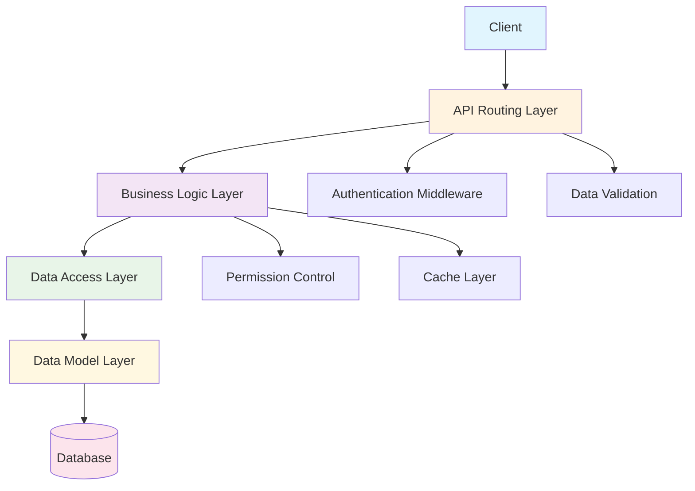
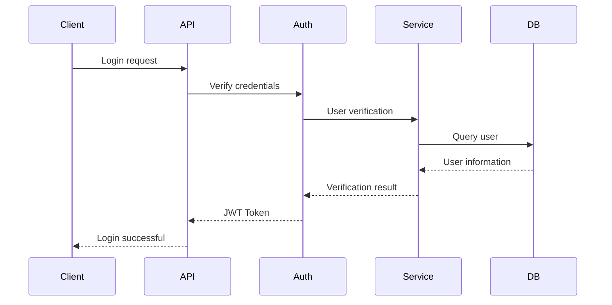
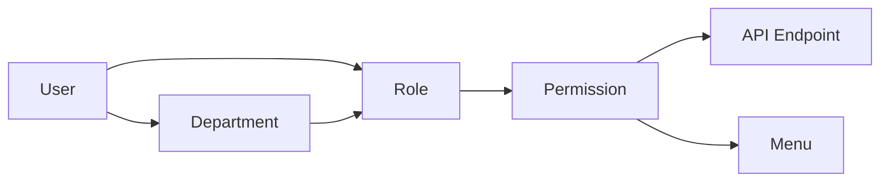
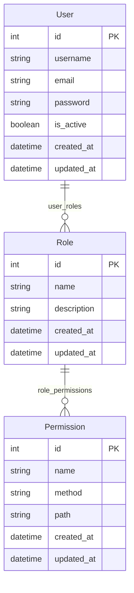

# Architecture Design

## System Architecture Overview

CODY is a corporate communication orchestration platform designed for high performance, rigorous governance, and data flexibility. It adopts a classic three-layer architecture design, ensuring code maintainability, scalability, and testability.




## Core Design Principles

### 1. Single Responsibility Principle
Each layer has clear responsibilities, avoiding confusion:

- **API Layer**: Handles HTTP requests and responses
- **Service Layer**: Implements business logic
- **Repository Layer**: Data access and persistence
- **Model Layer**: Data structure definition

### 2. Dependency Inversion Principle
High-level modules do not depend on low-level modules; decoupling is achieved through interfaces:

```python
# Service layer depends on Repository abstraction
class UserService:
    def __init__(self, user_repo: UserRepository):
        self.user_repo = user_repo
```

### 3. Open/Closed Principle
Open for extension, closed for modification:

```python
# Extend functionality through inheritance
class EnhancedUserService(UserService):
    def create_user_with_notification(self, user_data):
        user = super().create_user(user_data)
        self.send_notification(user)
        return user
```

## Detailed Layer Architecture

### API Layer (src/api/v1/)
Responsible for handling HTTP requests and responses, including:

- **Route Definition**: Defines API endpoints
- **Request Validation**: Validates input parameters
- **Response Formatting**: Unifies response format
- **Exception Handling**: Unified error handling

```python
@router.post("/users", response_model=UserResponse)
async def create_user(user_data: UserCreate):
    """Create user API endpoint"""
    return await user_service.create_user(user_data)
```

### Service Layer (src/services/)
Contains core business logic, including:

- **Business Rules**: Implements business logic
- **Permission Verification**: Checks user permissions
- **Transaction Management**: Coordinates multiple operations
- **Cache Management**: Data caching strategies

```python
class UserService:
    async def create_user(self, user_data: UserCreate):
        # Business logic validation
        if await self.user_repo.exists(email=user_data.email):
            raise ValueError("Email already exists")

        # Password encryption
        user_data.password = hash_password(user_data.password)

        # Create user
        return await self.user_repo.create(user_data)
```

### Repository Layer (src/repositories/)
Responsible for data access, including:

- **CRUD Operations**: Basic data operations
- **Query Building**: Complex query construction
- **Data Mapping**: Model and DTO conversion
- **Transaction Control**: Database transaction management

```python
class UserRepository:
    async def create(self, user_data: UserCreate) -> User:
        return await User.create(**user_data.dict())

    async def get_by_id(self, user_id: int) -> Optional[User]:
        return await User.get_or_none(id=user_id)
```

### Model Layer (src/models/)
Defines data structures, including:

- **Data Models**: Tortoise ORM models
- **Relationship Definitions**: Table relationship configuration
- **Index Configuration**: Database indexes
- **Constraint Definitions**: Data constraints

```python
class User(BaseModel, TimestampMixin):
    id = fields.IntField(pk=True)
    username = fields.CharField(max_length=50, unique=True)
    email = fields.CharField(max_length=100, unique=True)

    # Relationship definitions
    roles = fields.ManyToManyField("models.Role", related_name="users")
```

## Core Components

### 1. Authentication System
JWT-based authentication mechanism:



### 2. Permission Control
RBAC-based permission model:



### 3. Database Design Example
Data persistence using Tortoise ORM:




